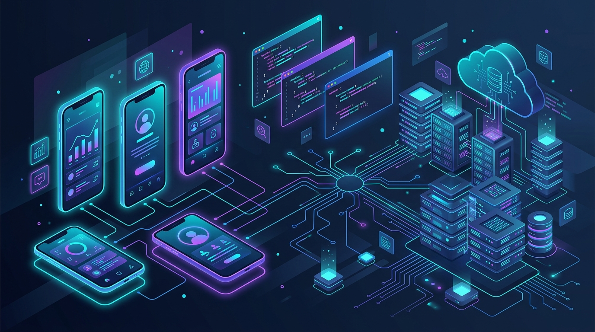
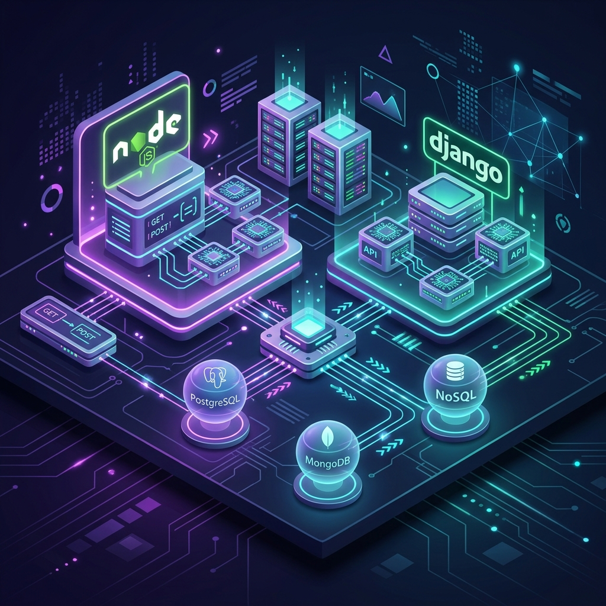
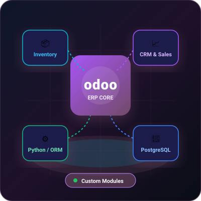
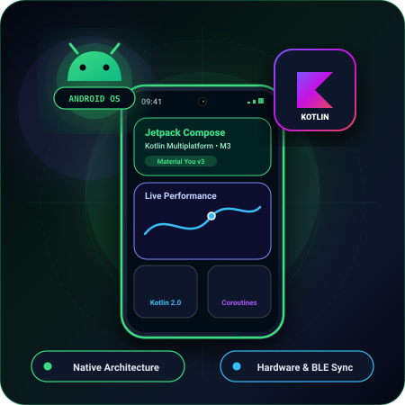
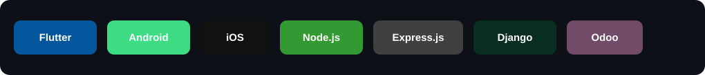

<!-- Custom local animated header banner (header-svg/banner.svg) -->

  

<!-- Profile Photo -->

  

<!-- Animated Typing Header -->

---

# 👨‍💻 About Me

### **Anurag Tiwari**
**Mobile App Developer | Backend Engineer | ERP Specialist**  
*Flutter • iOS • Android • Node.js • Express.js • Django • Odoo*

I build high-performance cross-platform mobile apps and scalable backend systems — from sleek Flutter applications for iOS & Android to robust REST APIs with Node.js/Express and Django, plus tailored ERP solutions in Odoo.

- 🎯 **Focus Areas:** Cross-Platform Mobile Apps, Backend Microservices, ERP (Odoo) Architecture
- 🌱 **Currently Learning:** Next.js, Microservices Architecture & Cloud System Design <!-- [EDITABLE] -->
- 💬 **Ask me about:** Flutter, Dart, iOS, Android, Node.js, Express.js, Django, Odoo ERP, PostgreSQL
- 📬 **Email:** [anuragtiwari1172000@gmail.com](mailto:anuragtiwari1172000@gmail.com)
- 📍 **Location:** India 🇮🇳 (Open to Remote & Global Opportunities) <!-- [EDITABLE] -->

  
  

  

---

## 🚀 Featured Projects

<table>
  <tr>
    <td width="50%" valign="top">
      

        
      

      <h3>📱 PulseMart — Flutter E-Commerce & Delivery App</h3>
      
Cross-platform mobile application built with Flutter & Dart for iOS and Android, featuring reactive Bloc state management, Firebase authentication, and live order tracking.

      

        
        
        
        
      

    </td>
    <td width="50%" valign="top">
      

        
      

      <h3>⚡ CloudSync — Scalable REST & Microservices Engine</h3>
      
High-performance backend service engineered with Node.js, Express.js, and Django, featuring JWT role-based auth, Redis caching, and WebSocket streams for sub-50ms latency.

      

        
        
        
        
      

    </td>
  </tr>
  <tr>
    <td width="50%" valign="top">
      

        
      

      <h3>🧩 Odoo Enterprise Inventory & Supply Automation</h3>
      
Custom Odoo module built with Python and PostgreSQL to automate complex warehouse workflows, barcode tracking, sales reporting, and tailored QWeb invoice generation.

      

        
        
        
        
      

    </td>
    <td width="50%" valign="top">
      

        
      

      <h3>📲 Native iOS & Android Integration Toolkit</h3>
      
Platform-specific modules in Swift and Kotlin showcasing hardware sensor access, background location sync, native widget extensions, and offline SQLite caching.

      

        
        
        
        
      

    </td>
  </tr>
</table>

---

## 🛠️ Tech Stack

  

 

**Mobile Development**

  
  
  
  
  
  

**Backend & APIs**

  
  
  
  
  

**ERP / Odoo**

  
  
  

**Databases & Tools**

  
  
  
  
  
  

---

## 📊 GitHub Stats

  
  

  

---

## 🐍 Contribution Snake

  

---

## 🎯 What I'm Looking For

Actively looking for **Mobile App Development**, **Backend Engineering**, and **Full-Stack / ERP Developer** roles and opportunities where I can build impactful products using Flutter, Node.js, Django, and Odoo.

Feel free to reach out if you'd like to collaborate, discuss architecture, or build something great together!

---

  

  

